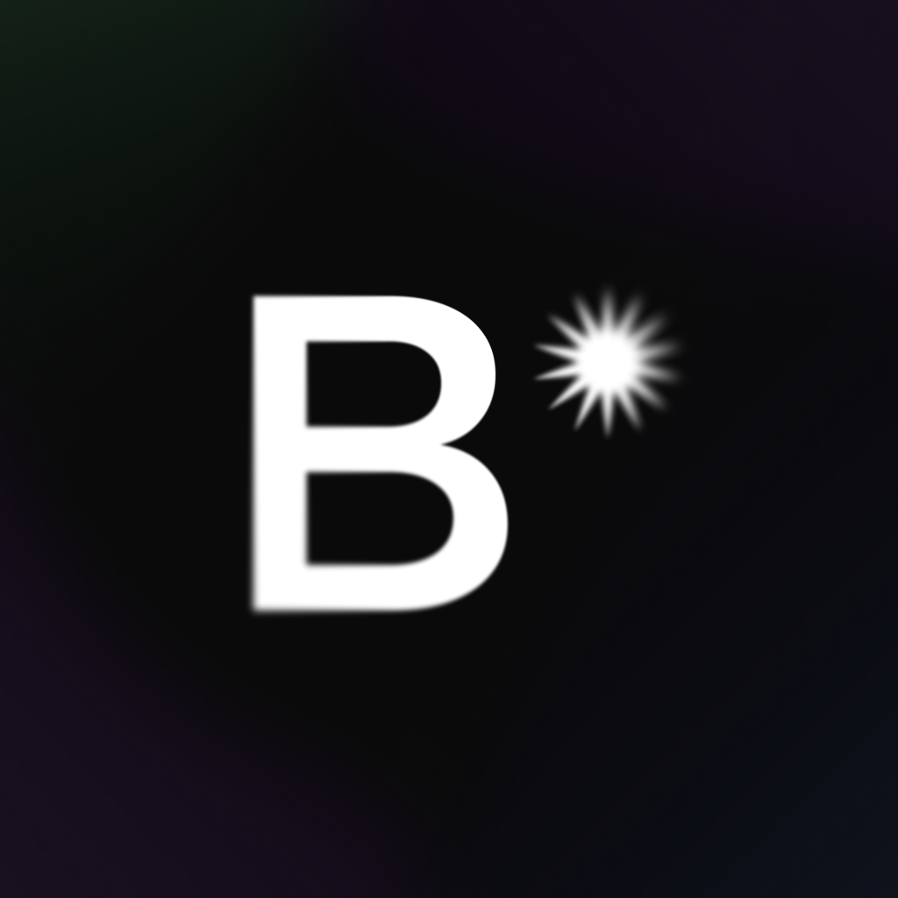
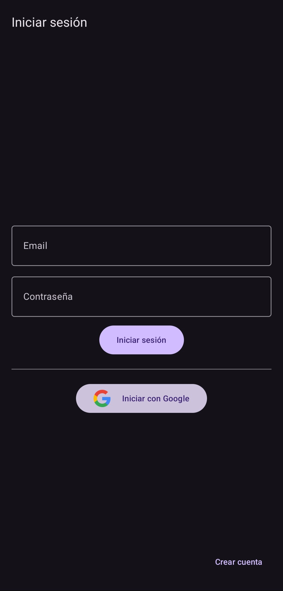
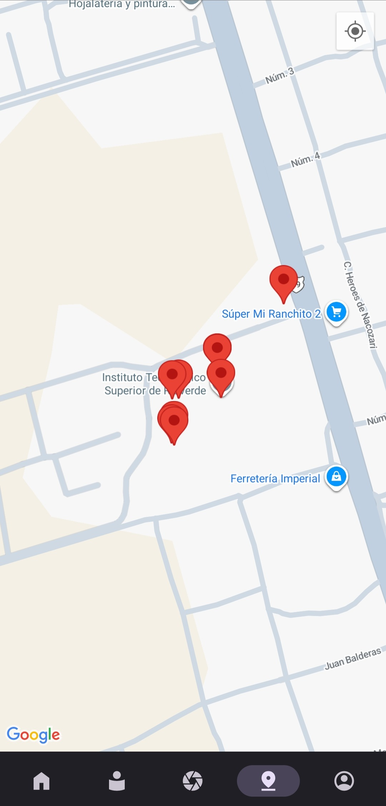
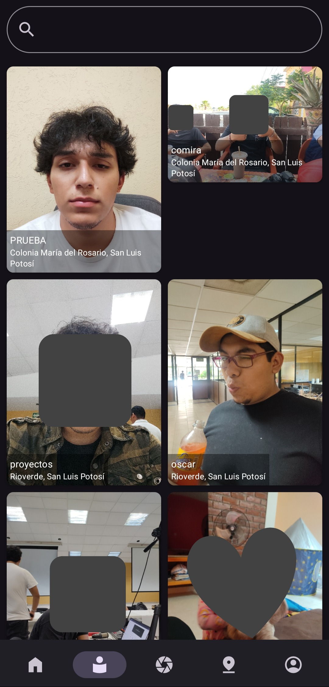
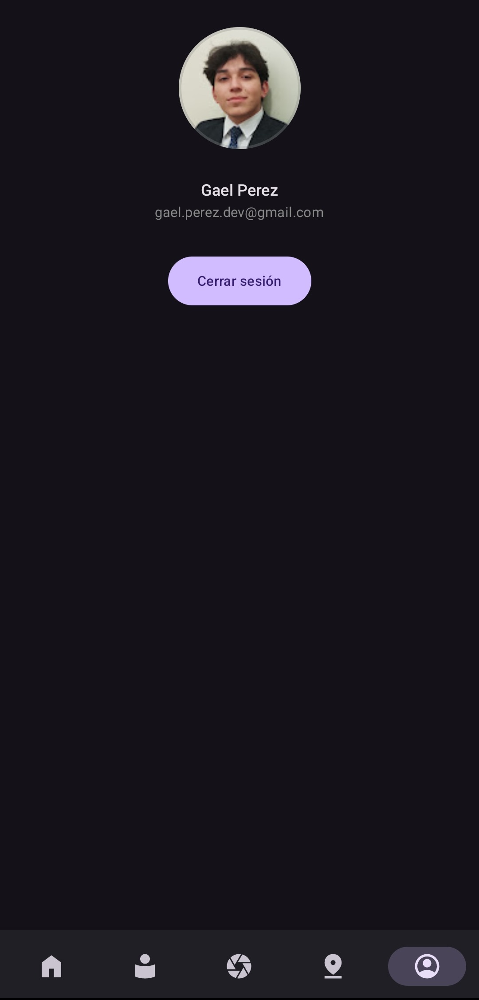

# Blinkr - Geolocation-Based Photo Vault (Showcase)

  

**Award-Winning Android App** that gamifies photo sharing by restricting access to photos based on the user's physical location.

> 🏆 **First Place** - Development Category, 2025 Computer Systems Engineering Project Presentation at Instituto Tecnológico Superior de Rioverde. The project was individually developed and judged by a panel including industry professionals from San Luis Potosí.

---

## Overview

Blinkr is a photo-sharing application with a unique twist. Users capture moments stored as "capsules" that are pinned to specific geographic locations. These capsules can only be unlocked and viewed by other users when they are physically near the place where the photo was taken. This creates a location-based social experience that encourages exploration and discovery.

This repository serves as a **showcase and portfolio piece**. The source code is kept private to protect the intellectual property and academic integrity of the project.

---

## Key Features

*   **🔐 Secure Authentication:** Login via Google Sign-In or email/password using Firebase Authentication.
*   **📍 Geolocked Content:** Photos are only unlockable by users within a close radius of the original capture location using device GPS.
*   **🌎 Interactive Map:** Explore a map view filled with pins representing hidden capsules waiting to be discovered.
*   **📸 Native Camera Integration:** Capture photos directly within the app to create new capsules instantly.
*   **🖼️ Personalized Vault & Feed:** A "For You" feed suggests nearby capsules, and a personal vault lets you manage creations with search functionality.
*   **👤 User Profiles:** Manage your account and view your collection with profile functionality.
*   **☁️ Cloud-Powered:** All data stored securely using Google Firebase (Firestore, Cloud Storage, Authentication).

---

## App Sections

- **Home Screen:** Features a "For You" feed with content recommendations and displays your current location name.
- **Vault:** View all unlocked photos with search functionality. Each capsule shows location data and optional labels.
- **Camera:** Capture photos directly through the app with flash and front/back camera support.
- **Map:** Visualize all unlocked capsules as pins on an interactive map. Tap pins to view details and images.
- **Profile:** Manage your account and sign out functionality.

---

## Tech Stack & Architecture

This project was built with a modern Android development stack:

*   **Language:** [Kotlin](https://kotlinlang.org/)
*   **UI Toolkit:** [Jetpack Compose](https://developer.android.com/jetpack/compose) (Modern Declarative UI)
*   **Backend & Database:** [Google Firebase](
    *   Firebase Authentication
    *   Cloud Firestore
    *   Cloud Storage for Firebase
*   **Maps & Location:** Google Maps SDK for Android, Fused Location Provider
*   **Camera:** CameraX with custom capture implementation
*   **Permissions:** Accompanist Permissions library
*   **Architecture:** MVVM (Model-View-ViewModel)
*   **Dependency Injection:** Hilt
*   **Geolocation:** GeoFire for location queries

---

## App Preview

| Login Screen | Camera Interface | Map View |
| :---: | :---: | :---: |
|  |  |  |

| Vault with Search | Capsule Details | Profile Screen |
| :---: | :---: | :---: |
|  |  |  |

---

## Installation

The application is currently in an early development stage and not publicly available for download. If you're interested in testing Blinkr or would like to see a demo, please contact me directly at [gael.perez.dev@gmail.com](mailto:gael.perez.dev@gmail.com) and I'd be happy to arrange a demonstration.

---

## Project Recognition

This project was developed as my capstone project and was awarded **First Place** in the Computer Systems Engineering project presentation (Development category) in 2025. The judging panel included external software engineers from the industry who praised the app's innovative concept, technical execution, and polish.

---

## Privacy Notice

This repository contains no proprietary source code. It is intended solely for demonstration and portfolio purposes. The complete source code is kept private to protect the academic integrity of the project and potential future commercialization opportunities.

---

## Contact

If you have any questions about the implementation, architecture, or would like to discuss this project further, please feel free to reach out!

*   **Email:** gael.perez.dev@gmail.com
*   **LinkedIn:** [linkedin.com/in/gaelperezdev](http://linkedin.com/in/gaelperezdev)
*   **GitHub:** [github.com/uwiwlow](http://github.com/uwiwlow)

---

## License

This showcase repository is provided for demonstration purposes only. All rights to the Blinkr application and its code are reserved.
